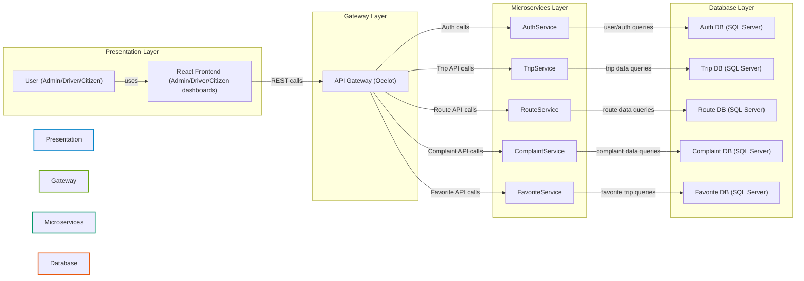

# DepartureCenterSystem: Microservices Architecture Diagram

## Overview
This diagram explains the system architecture for the public transportation management platform.

- Roles: Admin, Driver, Citizen
- Frontend: React (Vite)
- Backend: .NET Microservices
- API communication: REST
- Database: SQL Server (one per microservice, optionally shared as needed)
- Containerization: Docker
- Auth: AuthService (JWT)
- API Gateway: Ocelot

## Mermaid Architecture Diagram

## Data Flow Explanation

1. User action (Admin/Driver/Citizen) occurs in the React frontend.
2. Frontend makes REST API calls to API Gateway (Ocelot).
3. API Gateway routes each request to the appropriate microservice:
   - AuthService for login/registration/JWT issuance.
   - TripService for trip scheduling, status, and booking.
   - RouteService for route management and stop data.
   - ComplaintService for complaint submission and status updates.
   - FavoriteService for managing saved favorite trips.
4. Each microservice reads from/writes to its own SQL Server database.
5. AuthService responses include JWT tokens for protected routes.
6. Frontend stores token in secure storage and sends it with subsequent requests.
7. The gateway verifies token through AuthService (or local validation) before forwarding.

## Notes

- The architecture follows strict separation by layer: Presentation, Gateway, Microservices, Data.
- Communication is primarily REST-based; internal microservices can be extended with async messaging if needed.
- Each microservice can be deployed in Docker containers and orchestrated using Docker Compose or Kubernetes.
