# Frontend Site Map

This document describes the main frontend routes and navigation structure for the Departure Center Management System.

## Overview

The frontend uses `react-router-dom` and organizes routes by user role. Public authentication routes are separate, while the main app routes are nested inside `MainLayout` and protected by `ProtectedRoute`.

- `/login` — Login page
- `/register` — Register page
- `/` — Dashboard entry point (redirects by role)
- `/notifications` — Notifications center
- Admin, Driver, Citizen, Auditor, Organizer, and Live Tracking sections are all protected by role-based route guards.

## Root Route

- `/` — Dashboard
  - redirects by user role to the appropriate main panel
  - handled by `frontend/src/pages/Dashboard.jsx`

## Public Routes

- `/login` — `frontend/src/pages/auth/Login.jsx`
- `/register` — `frontend/src/pages/auth/Register.jsx`

## Shared Routes

- `/notifications` — `frontend/src/pages/NotificationsPage.jsx`
- `*` — fallback redirect to `/`

## Admin Routes

- `/admin/routes` — `frontend/src/pages/admin/ManageRoutes.jsx`
- `/admin/routes/:routeId` — `frontend/src/pages/admin/RouteDetails.jsx`
- `/admin/trips` — `frontend/src/pages/admin/ManageTrips.jsx`
- `/admin/emergencies` — `frontend/src/pages/admin/ManageEmergencies.jsx`
- `/admin/trips/:tripId` — `frontend/src/pages/admin/TripDetails.jsx`
- `/admin/drivers` — `frontend/src/pages/admin/ManageDrivers.jsx`
- `/admin/drivers/:id` — `frontend/src/pages/admin/ManageDriversDetails.jsx`
- `/admin/users` — `frontend/src/pages/admin/ManageUsers.jsx`
- `/admin/users/:id` — `frontend/src/pages/admin/ManageUsersDetails.jsx`
- `/admin/auditors` — `frontend/src/pages/admin/ManageAuditors.jsx`
- `/admin/auditors/:id` — `frontend/src/pages/admin/ManageAuditorsDetails.jsx`
- `/admin/organizers` — `frontend/src/pages/admin/ManageOrganizers.jsx`
- `/admin/organizers/:id` — `frontend/src/pages/admin/ManageOrganizersDetails.jsx`
- `/admin/profile` — `frontend/src/pages/admin/AdminProfile.jsx`
- `/admin/complaints` — `frontend/src/pages/admin/ViewComplaints.jsx`
- `/admin/vehicles` — `frontend/src/pages/admin/ManageVehicles.jsx`
- `/admin/vehicles/:vehicleId` — `frontend/src/pages/admin/VehicleDetails.jsx`

## Driver Routes

- `/driver/profile` — `frontend/src/pages/driver/DriverProfile.jsx`
- `/driver/trips` — `frontend/src/pages/driver/DriverTrips.jsx`
- `/driver/complaints` — `frontend/src/pages/driver/DriverSubmitComplaint.jsx`

## Citizen Routes

- `/citizen/profile` — `frontend/src/pages/citizen/MyProfile.jsx`
- `/citizen/trips` — `frontend/src/pages/citizen/CitizenTrips.jsx`
- `/citizen/favorites` — `frontend/src/pages/citizen/FavoriteTrips.jsx`
- `/citizen/bookings` — `frontend/src/pages/citizen/MyBookings.jsx`
- `/citizen/complaints` — `frontend/src/pages/citizen/SubmitComplaint.jsx`

## Auditor Routes

- `/auditor/dashboard` — `frontend/src/pages/auditor/AuditorDashboard.jsx`
- `/auditor/available` — `frontend/src/pages/auditor/AvailableTrips.jsx`
- `/auditor/active` — `frontend/src/pages/auditor/ActiveAudit.jsx`
- `/auditor/history` — `frontend/src/pages/auditor/AuditHistory.jsx`
- `/auditor/profile` — `frontend/src/pages/auditor/AuditorProfile.jsx`

## Organizer Routes

- `/organizer/profile` — `frontend/src/pages/organizer/OrganizerProfile.jsx`
- `/organizer/dashboard` — `frontend/src/pages/organizer/OrganizerDashboard.jsx`
- `/organizer/queues` — `frontend/src/pages/organizer/OrganizerQueueManagement.jsx`
- `/organizer/complaints` — `frontend/src/pages/organizer/OrganizerComplaints.jsx`
- `/organizer/violations` — `frontend/src/pages/organizer/OrganizerViolations.jsx`

## Live Tracking Routes

- `/live-tracking` — `frontend/src/pages/organizer/LiveTrackingDashboard.jsx`
- `/live-tracking/:tripId` — `frontend/src/pages/organizer/TripTrackingDetails.jsx`

## Route Guard Behavior

The route tree is wrapped by `ProtectedRoute` for authenticated access. Role restrictions include:

- Admin routes: `['Admin']`
- Driver routes: `['Driver']`
- Citizen routes: `['Citizen']`
- Auditor routes: `['Auditor']`
- Queue organizer routes: `['QueueOrganizer']`
- Live tracking routes: `['Admin','Citizen','Driver','QueueOrganizer','Dispatcher','Auditor']`
- Complaint page for `/citizen/complaints` is available to both `Citizen` and `Driver`

## Site Map Diagram

Use the Mermaid diagram below to visualize page flow.

```mermaid
flowchart TD
    A[Login/Register] --> B[Dashboard / Home]
    B --> C[Notifications]
    B --> D[Admin Section]
    B --> E[Driver Section]
    B --> F[Citizen Section]
    B --> G[Auditor Section]
    B --> H[Organizer Section]
    B --> I[Live Tracking]

    D --> D1[Manage Routes]
    D --> D2[Route Details]
    D --> D3[Manage Trips]
    D --> D4[Trip Details]
    D --> D5[Manage Emergencies]
    D --> D6[Manage Drivers]
    D --> D7[Driver Details]
    D --> D8[Manage Users]
    D --> D9[User Details]
    D --> D10[Manage Auditors]
    D --> D11[Auditor Details]
    D --> D12[Manage Organizers]
    D --> D13[Organizer Details]
    D --> D14[Admin Profile]
    D --> D15[Complaints]
    D --> D16[Manage Vehicles]
    D --> D17[Vehicle Details]

    E --> E1[Driver Profile]
    E --> E2[Driver Trips]
    E --> E3[Submit Complaint]

    F --> F1[Citizen Profile]
    F --> F2[Citizen Trips]
    F --> F3[Favorites]
    F --> F4[Bookings]
    F --> F5[Submit Complaint]

    G --> G1[Auditor Dashboard]
    G --> G2[Available Trips]
    G --> G3[Active Audit]
    G --> G4[Audit History]
    G --> G5[Auditor Profile]

    H --> H1[Organizer Profile]
    H --> H2[Organizer Dashboard]
    H --> H3[Queue Management]
    H --> H4[Organizer Complaints]
    H --> H5[Violations]

    I --> I1[Live Tracking Dashboard]
    I --> I2[Trip Tracking Details]

    style A fill:#f9f,stroke:#333,stroke-width:1px
    style B fill:#bbf,stroke:#333,stroke-width:1px
    style D fill:#ffd,stroke:#333,stroke-width:1px
    style E fill:#dfd,stroke:#333,stroke-width:1px
    style F fill:#ddf,stroke:#333,stroke-width:1px
    style G fill:#fdd,stroke:#333,stroke-width:1px
    style H fill:#dff,stroke:#333,stroke-width:1px
    style I fill:#cfc,stroke:#333,stroke-width:1px
```

## Notes

- The dashboard route `/` is the common landing page after login and redirects users by role.
- Admin routes contain the most nested management pages.
- Live tracking routes are accessible by many roles, not just admin.
- This sitemap is based on `frontend/src/App.jsx` route declarations.
