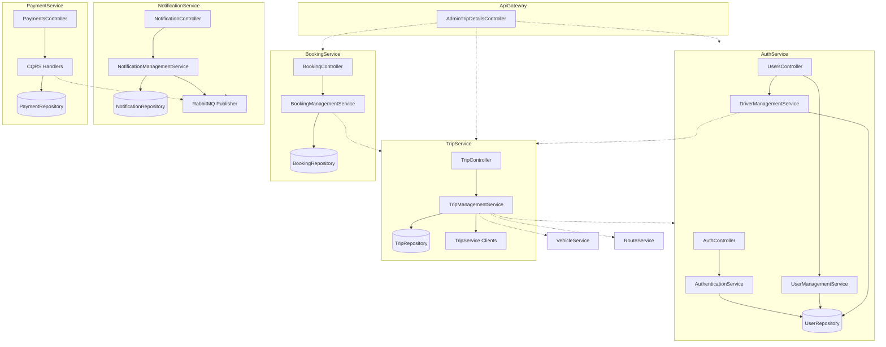

# Class Diagram — Departure Center Management System

This document describes the **structural relationships** between classes and interfaces across the Departure Center Management System microservices. Each service follows a layered architecture: **Domain → Application → Infrastructure → Api**.

Relationship notation used throughout:

| Notation | Meaning |
|----------|---------|
| `[A] : [B]` | Inheritance (is-a) |
| `[A] : [I]` | Implementation / Realization (implements interface) |
| `[A] → [B]` | Dependency (constructor injection, parameters, or factory) |
| `[A] ◇— [B]` | Aggregation (holds reference; shared lifecycle) |
| `[A] ◆— [B]` | Composition (creates/owns; tightly coupled lifecycle) |
| `[A] — [B]` | Association (loose usage via parameters, return types, or properties) |

---

## Interfaces

### AuthService

| Interface | Purpose |
|-----------|---------|
| `IUserRepository` | User persistence contract |
| `IUserManagementService` | Admin user CRUD contract |
| `IUserQueryService` | User read/query contract |
| `IAuthenticationService` | Registration and login contract |
| `IDriverManagementService` | Driver account management contract |
| `IAuditorManagementService` | Auditor account management contract |
| `IQueueOrganizerManagementService` | Queue organizer account management contract |
| `IJwtProvider` | JWT token generation contract |
| `ITripServiceClient` | Cross-service TripService HTTP client contract |

### TripService

| Interface | Purpose |
|-----------|---------|
| `ITripRepository` | Trip persistence contract |
| `IDriverProfileRepository` | Driver profile persistence contract |
| `IEmergencyRepository` | Emergency report persistence contract |
| `ITripService` | Trip management contract |
| `IDriverProfileService` | Driver profile management contract |
| `IDriverChangeRequestService` | Driver change request contract |
| `IEmergencyService` | Emergency report management contract |
| `IAuthServiceClient` | Cross-service AuthService HTTP client contract |
| `IVehicleServiceClient` | Cross-service VehicleService HTTP client contract |
| `IRouteServiceClient` | Cross-service RouteService HTTP client contract |
| `IBookingServiceClient` | Cross-service BookingService HTTP client contract |

### BookingService

| Interface | Purpose |
|-----------|---------|
| `IBookingRepository` | Booking persistence contract |
| `IBookingService` | Booking management contract |
| `ITripServiceClient` | Cross-service TripService HTTP client contract |

### RouteService

| Interface | Purpose |
|-----------|---------|
| `IRouteRepository` | Route persistence contract |
| `IRouteService` | Route management contract |
| `ITripServiceClient` | Cross-service TripService HTTP client contract |

### VehicleService

| Interface | Purpose |
|-----------|---------|
| `IVehicleRepository` | Vehicle persistence contract |
| `IVehicleService` | Vehicle management contract |

### ComplaintService

| Interface | Purpose |
|-----------|---------|
| `IComplaintRepository` | Complaint persistence contract |
| `IComplaintService` | Complaint management contract |

### NotificationService

| Interface | Purpose |
|-----------|---------|
| `INotificationRepository` | Notification persistence contract |
| `INotificationManagementService` | Notification creation and delivery contract |
| `INotificationPreferenceService` | User notification preference contract |
| `INotificationTemplateService` | Notification template contract |
| `IReminderService` | Scheduled reminder contract |
| `INotificationChannel` | Pluggable notification delivery channel contract |
| `INotificationSender` | Push notification sender contract |
| `IRabbitMqEventPublisher` | RabbitMQ event publishing contract |
| `IRabbitMqConnection` | RabbitMQ connection contract |
| `INotificationClient` | SignalR client callback contract |

### OrganizerService

| Interface | Purpose |
|-----------|---------|
| `IOrganizerRepository` | Organizer and queue persistence contract |
| `ITripServiceClient` | Cross-service TripService HTTP client contract |

### AuditService

| Interface | Purpose |
|-----------|---------|
| `IAuditRepository` | Audit record and trip audit persistence contract |
| `ITripServiceClient` | Cross-service TripService HTTP client contract |
| `IBookingServiceClient` | Cross-service BookingService HTTP client contract |
| `IRabbitMqConnection` | RabbitMQ connection contract |

### LiveTrackingService

| Interface | Purpose |
|-----------|---------|
| `ILiveTrackingRepository` | Live tracking persistence contract |
| `IRabbitMqEventPublisher` | RabbitMQ event publishing contract |
| `IRabbitMqConnection` | RabbitMQ connection contract |
| `ILiveTrackingClient` | SignalR client callback contract |

### PaymentService

| Interface | Purpose |
|-----------|---------|
| `IPaymentRepository` | Payment persistence contract |
| `IStripePaymentGateway` | Stripe payment gateway contract |
| `IPaymentEventPublisher` | Payment integration event publishing contract |
| `IRabbitMqEventPublisher` | RabbitMQ event publishing contract |
| `IRabbitMqConnection` | RabbitMQ connection contract |

---

## Classes

### AuthService

**Domain Entities**

- `User`

**Application Services**

- `AuthenticationService`
- `UserManagementService`
- `UserQueryService`
- `DriverManagementService`
- `AuditorManagementService`
- `QueueOrganizerManagementService`

**Infrastructure**

- `UserRepository`
- `AuthDbContext`
- `JwtProvider`
- `TripServiceClient`

**API**

- `AuthController`
- `UsersController`
- `ExceptionMiddleware`

---

### TripService

**Domain Entities**

- `Trip`
- `DriverProfile`
- `DriverChangeRequest`
- `EmergencyReport`

**Application Services**

- `TripManagementService`
- `DriverProfileService`
- `DriverChangeRequestService`
- `EmergencyService`

**Infrastructure**

- `TripRepository`
- `DriverProfileRepository`
- `EmergencyRepository`
- `TripDbContext`
- `AuthServiceClient`
- `VehicleServiceClient`
- `RouteServiceClient`
- `BookingServiceClient`

**API**

- `TripController`
- `DriverProfileController`
- `DriverChangeRequestController`
- `EmergencyController`
- `ExceptionMiddleware`

---

### BookingService

**Domain Entities**

- `Booking`

**Application Services**

- `BookingManagementService`

**Infrastructure**

- `BookingRepository`
- `BookingDbContext`
- `TripServiceClient`

**API**

- `BookingController`
- `ExceptionMiddleware`

---

### RouteService

**Domain Entities**

- `Route`

**Application Services**

- `RouteManagementService`

**Infrastructure**

- `RouteRepository`
- `RouteDbContext`
- `TripServiceClient`

**API**

- `RouteController`
- `ExceptionMiddleware`

---

### VehicleService

**Domain Entities**

- `Vehicle`

**Application Services**

- `VehicleManagementService`

**Infrastructure**

- `VehicleRepository`
- `VehicleDbContext`

**API**

- `VehicleController`

---

### ComplaintService

**Domain Entities**

- `Complaint`

**Application Services**

- `ComplaintManagementService`

**Infrastructure**

- `ComplaintRepository`
- `ComplaintDbContext`

**API**

- `ComplaintController`
- `ExceptionMiddleware`

---

### NotificationService

**Domain Entities**

- `Notification`
- `NotificationPreference`
- `NotificationTemplate`
- `ScheduledReminder`

**Application Services**

- `NotificationManagementService`
- `NotificationPreferenceService`
- `NotificationTemplateService`
- `ReminderService`

**Integration Events**

- `IntegrationEvent` (abstract)
- `TripDepartureReminderEvent`
- `TripBookedEvent`
- `PaymentSuccessfulEvent`
- `NotificationCreatedEvent`
- `FavoriteRouteMatchedEvent`
- `DriverAssignedEvent`
- `ComplaintResponseEvent`

**Infrastructure**

- `NotificationRepository`
- `NotificationDbContext`
- `NotificationDbContextFactory`

**API — Channels & Messaging**

- `InAppNotificationChannel`
- `FcmNotificationSender`
- `ExpoNotificationSender`
- `RabbitMqConnection`
- `RabbitMqEventPublisher`
- `RabbitMqOptions`
- `NotificationIntegrationEventHandler`
- `RabbitMqEventConsumerHostedService`
- `TripReminderBackgroundService`
- `PushReceiptPollingService`

**API — Hubs & Controllers**

- `NotificationHub`
- `NotificationController`
- `NotificationPreferencesController`
- `RemindersController`
- `ExceptionMiddleware`

---

### OrganizerService

**Domain Entities**

- `Organizer`
- `OrganizerActionLog`
- `QueuePackage`
- `QueuePackageTrip`

**Application Services**

- `OrganizerService`
- `OrganizerQueueService`

**Infrastructure**

- `OrganizerRepository`
- `OrganizerDbContext`
- `TripServiceClient`

**API**

- `OrganizerController`
- `QueueController`

---

### AuditService

**Domain Entities**

- `AuditRecord`
- `TripAudit`

**Application Services**

- `AuditService`

**Infrastructure**

- `AuditRepository`
- `AuditDbContext`
- `TripServiceClient`
- `BookingServiceClient`

**API — Messaging**

- `RabbitMqConnection`
- `RabbitMqOptions`
- `AuditIntegrationEventHandler`
- `RabbitMqEventConsumerHostedService`

**API**

- `AuditController`

---

### LiveTrackingService

**Domain Entities**

- `LiveTripTracking`
- `TrackingHistory`

**Application Services**

- `LiveTrackingService`

**Integration Events**

- `IntegrationEvent` (abstract)
- `TrackingStartedEvent`
- `TrackingStoppedEvent`
- `LocationUpdatedEvent`

**Infrastructure**

- `LiveTrackingRepository`
- `LiveTrackingDbContext`

**API — Messaging & Hosting**

- `RabbitMqConnection`
- `RabbitMqEventPublisher`
- `RabbitMqOptions`
- `TripStatusSyncService`

**API — Hubs & Controllers**

- `LiveTrackingHub`
- `DriverTrackingController`
- `ClientTrackingController`

---

### PaymentService

**Domain Entities**

- `Payment`

**Application — CQRS Commands & Queries**

- `CreatePaymentIntentCommand`
- `ConfirmPaymentCommand`
- `GetPaymentByIdQuery`
- `GetPaymentByPaymentIntentIdQuery`

**Application — CQRS Handlers**

- `CreatePaymentIntentCommandHandler`
- `ConfirmPaymentCommandHandler`
- `GetPaymentByIdQueryHandler`
- `GetPaymentByPaymentIntentIdQueryHandler`

**Integration Events**

- `IntegrationEvent` (abstract)
- `PaymentSuccessfulEvent`

**Infrastructure**

- `PaymentRepository`
- `PaymentDbContext`
- `StripePaymentGateway`
- `StripeOptions`

**API — Messaging**

- `RabbitMqConnection`
- `RabbitMqEventPublisher`
- `RabbitMqOptions`

**API**

- `PaymentsController`
- `ExceptionMiddleware`

---

### ApiGateway

**API**

- `AdminTripDetailsController`

---

## Relationships

### Inheritance

| Relationship | Explanation |
|--------------|-------------|
| `AuthController` : `ControllerBase` | ASP.NET API controller base |
| `UsersController` : `ControllerBase` | ASP.NET API controller base |
| `TripController` : `ControllerBase` | ASP.NET API controller base |
| `DriverProfileController` : `ControllerBase` | ASP.NET API controller base |
| `DriverChangeRequestController` : `ControllerBase` | ASP.NET API controller base |
| `EmergencyController` : `ControllerBase` | ASP.NET API controller base |
| `BookingController` : `ControllerBase` | ASP.NET API controller base |
| `RouteController` : `ControllerBase` | ASP.NET API controller base |
| `VehicleController` : `ControllerBase` | ASP.NET API controller base |
| `ComplaintController` : `ControllerBase` | ASP.NET API controller base |
| `NotificationController` : `ControllerBase` | ASP.NET API controller base |
| `NotificationPreferencesController` : `ControllerBase` | ASP.NET API controller base |
| `RemindersController` : `ControllerBase` | ASP.NET API controller base |
| `OrganizerController` : `ControllerBase` | ASP.NET API controller base |
| `QueueController` : `ControllerBase` | ASP.NET API controller base |
| `AuditController` : `ControllerBase` | ASP.NET API controller base |
| `DriverTrackingController` : `ControllerBase` | ASP.NET API controller base |
| `ClientTrackingController` : `ControllerBase` | ASP.NET API controller base |
| `PaymentsController` : `ControllerBase` | ASP.NET API controller base |
| `AdminTripDetailsController` : `ControllerBase` | API gateway controller base |
| `AuthDbContext` : `DbContext` | EF Core persistence context |
| `TripDbContext` : `DbContext` | EF Core persistence context |
| `BookingDbContext` : `DbContext` | EF Core persistence context |
| `RouteDbContext` : `DbContext` | EF Core persistence context |
| `VehicleDbContext` : `DbContext` | EF Core persistence context |
| `ComplaintDbContext` : `DbContext` | EF Core persistence context |
| `NotificationDbContext` : `DbContext` | EF Core persistence context |
| `OrganizerDbContext` : `DbContext` | EF Core persistence context |
| `AuditDbContext` : `DbContext` | EF Core persistence context |
| `LiveTrackingDbContext` : `DbContext` | EF Core persistence context |
| `PaymentDbContext` : `DbContext` | EF Core persistence context |
| `NotificationHub` : `Hub<INotificationClient>` | SignalR hub base |
| `LiveTrackingHub` : `Hub<ILiveTrackingClient>` | SignalR hub base |
| `RabbitMqEventConsumerHostedService` : `BackgroundService` | Long-running hosted service (NotificationService, AuditService) |
| `TripReminderBackgroundService` : `BackgroundService` | Scheduled reminder polling |
| `PushReceiptPollingService` : `BackgroundService` | Push delivery receipt polling |
| `TripStatusSyncService` : `BackgroundService` | Trip status synchronization |
| `TripDepartureReminderEvent` : `IntegrationEvent` | Notification integration event hierarchy |
| `TripBookedEvent` : `IntegrationEvent` | Notification integration event hierarchy |
| `PaymentSuccessfulEvent` : `IntegrationEvent` | Notification / Payment integration event hierarchy |
| `NotificationCreatedEvent` : `IntegrationEvent` | Notification integration event hierarchy |
| `FavoriteRouteMatchedEvent` : `IntegrationEvent` | Notification integration event hierarchy |
| `DriverAssignedEvent` : `IntegrationEvent` | Notification integration event hierarchy |
| `ComplaintResponseEvent` : `IntegrationEvent` | Notification integration event hierarchy |
| `TrackingStartedEvent` : `IntegrationEvent` | LiveTracking integration event hierarchy |
| `TrackingStoppedEvent` : `IntegrationEvent` | LiveTracking integration event hierarchy |
| `LocationUpdatedEvent` : `IntegrationEvent` | LiveTracking integration event hierarchy |

---

### Implementation / Realization

| Relationship | Explanation |
|--------------|-------------|
| `UserRepository` : `IUserRepository` | User persistence implementation |
| `AuthenticationService` : `IAuthenticationService` | Authentication logic implementation |
| `UserManagementService` : `IUserManagementService` | User management implementation |
| `UserQueryService` : `IUserQueryService` | User query implementation |
| `DriverManagementService` : `IDriverManagementService` | Driver management implementation |
| `AuditorManagementService` : `IAuditorManagementService` | Auditor management implementation |
| `QueueOrganizerManagementService` : `IQueueOrganizerManagementService` | Queue organizer management implementation |
| `JwtProvider` : `IJwtProvider` | JWT generation implementation |
| `AuthService.TripServiceClient` : `AuthService.ITripServiceClient` | Auth → Trip HTTP client |
| `TripRepository` : `ITripRepository` | Trip persistence implementation |
| `DriverProfileRepository` : `IDriverProfileRepository` | Driver profile persistence implementation |
| `EmergencyRepository` : `IEmergencyRepository` | Emergency persistence implementation |
| `TripManagementService` : `ITripService` | Trip management implementation |
| `DriverProfileService` : `IDriverProfileService` | Driver profile management implementation |
| `DriverChangeRequestService` : `IDriverChangeRequestService` | Driver change request implementation |
| `EmergencyService` : `IEmergencyService` | Emergency management implementation |
| `AuthServiceClient` : `IAuthServiceClient` | Trip → Auth HTTP client |
| `VehicleServiceClient` : `IVehicleServiceClient` | Trip → Vehicle HTTP client |
| `RouteServiceClient` : `IRouteServiceClient` | Trip → Route HTTP client |
| `BookingServiceClient` : `IBookingServiceClient` | Trip → Booking HTTP client |
| `BookingRepository` : `IBookingRepository` | Booking persistence implementation |
| `BookingManagementService` : `IBookingService` | Booking management implementation |
| `BookingService.TripServiceClient` : `BookingService.ITripServiceClient` | Booking → Trip HTTP client |
| `RouteRepository` : `IRouteRepository` | Route persistence implementation |
| `RouteManagementService` : `IRouteService` | Route management implementation |
| `RouteService.TripServiceClient` : `RouteService.ITripServiceClient` | Route → Trip HTTP client |
| `VehicleRepository` : `IVehicleRepository` | Vehicle persistence implementation |
| `VehicleManagementService` : `IVehicleService` | Vehicle management implementation |
| `ComplaintRepository` : `IComplaintRepository` | Complaint persistence implementation |
| `ComplaintManagementService` : `IComplaintService` | Complaint management implementation |
| `NotificationRepository` : `INotificationRepository` | Notification persistence implementation |
| `NotificationManagementService` : `INotificationManagementService` | Notification management implementation |
| `NotificationPreferenceService` : `INotificationPreferenceService` | Preference management implementation |
| `NotificationTemplateService` : `INotificationTemplateService` | Template management implementation |
| `ReminderService` : `IReminderService` | Reminder management implementation |
| `InAppNotificationChannel` : `INotificationChannel` | In-app delivery channel |
| `FcmNotificationSender` : `INotificationSender` | FCM push sender |
| `ExpoNotificationSender` : `INotificationSender` | Expo push sender |
| `NotificationService.RabbitMqEventPublisher` : `IRabbitMqEventPublisher` | RabbitMQ publisher (NotificationService) |
| `NotificationService.RabbitMqConnection` : `IRabbitMqConnection` | RabbitMQ connection (NotificationService) |
| `NotificationDbContextFactory` : `IDesignTimeDbContextFactory<NotificationDbContext>` | Design-time DbContext factory |
| `OrganizerRepository` : `IOrganizerRepository` | Organizer persistence implementation |
| `OrganizerService.TripServiceClient` : `OrganizerService.ITripServiceClient` | Organizer → Trip HTTP client |
| `AuditRepository` : `IAuditRepository` | Audit persistence implementation |
| `AuditService.TripServiceClient` : `AuditService.ITripServiceClient` | Audit → Trip HTTP client |
| `AuditService.BookingServiceClient` : `AuditService.IBookingServiceClient` | Audit → Booking HTTP client |
| `AuditService.RabbitMqConnection` : `IRabbitMqConnection` | RabbitMQ connection (AuditService) |
| `LiveTrackingRepository` : `ILiveTrackingRepository` | Live tracking persistence implementation |
| `LiveTrackingService.RabbitMqEventPublisher` : `IRabbitMqEventPublisher` | RabbitMQ publisher (LiveTrackingService) |
| `LiveTrackingService.RabbitMqConnection` : `IRabbitMqConnection` | RabbitMQ connection (LiveTrackingService) |
| `PaymentRepository` : `IPaymentRepository` | Payment persistence implementation |
| `StripePaymentGateway` : `IStripePaymentGateway` | Stripe gateway implementation |
| `PaymentService.RabbitMqEventPublisher` : `IRabbitMqEventPublisher` | RabbitMQ publisher (PaymentService) |
| `PaymentService.RabbitMqEventPublisher` : `IPaymentEventPublisher` | Payment event publisher |
| `PaymentService.RabbitMqConnection` : `IRabbitMqConnection` | RabbitMQ connection (PaymentService) |
| `CreatePaymentIntentCommandHandler` : `IRequestHandler` | MediatR command handler |
| `ConfirmPaymentCommandHandler` : `IRequestHandler` | MediatR command handler |
| `GetPaymentByIdQueryHandler` : `IRequestHandler` | MediatR query handler |
| `GetPaymentByPaymentIntentIdQueryHandler` : `IRequestHandler` | MediatR query handler |

---

### Dependency

#### API Layer → Application Layer

| Relationship | Explanation |
|--------------|-------------|
| `AuthController` → `IAuthenticationService` | Login and registration |
| `UsersController` → `IUserQueryService` | User read operations |
| `UsersController` → `IUserManagementService` | User write operations |
| `UsersController` → `IDriverManagementService` | Driver management |
| `UsersController` → `IAuditorManagementService` | Auditor management |
| `UsersController` → `IQueueOrganizerManagementService` | Queue organizer management |
| `TripController` → `ITripService` | Trip endpoints |
| `DriverProfileController` → `IDriverProfileService` | Driver profile endpoints |
| `DriverChangeRequestController` → `IDriverChangeRequestService` | Driver change request endpoints |
| `EmergencyController` → `IEmergencyService` | Emergency endpoints |
| `BookingController` → `IBookingService` | Booking endpoints |
| `RouteController` → `IRouteService` | Route endpoints |
| `VehicleController` → `IVehicleService` | Vehicle endpoints |
| `ComplaintController` → `IComplaintService` | Complaint endpoints |
| `NotificationController` → `INotificationManagementService` | Notification endpoints |
| `NotificationPreferencesController` → `INotificationPreferenceService` | Preference endpoints |
| `RemindersController` → `IReminderService` | Reminder endpoints |
| `OrganizerController` → `OrganizerService` | Organizer endpoints |
| `QueueController` → `OrganizerQueueService` | Queue package endpoints |
| `AuditController` → `AuditService` | Audit operations |
| `AuditController` → `IAuditRepository` | Direct audit data access |
| `AuditController` → `ITripServiceClient` | Trip validation |
| `AuditController` → `IBookingServiceClient` | Booking validation |
| `ClientTrackingController` → `LiveTrackingService` | Client tracking endpoints |
| `DriverTrackingController` → `IRabbitMqEventPublisher` | Location event publishing |
| `DriverTrackingController` → `LiveTrackingHub` | Real-time hub broadcasting |
| `PaymentsController` → `IMediator` | CQRS command/query dispatch |
| `AdminTripDetailsController` → `HttpClient` | Aggregated downstream HTTP calls |

#### Application Layer → Repository / Client Interfaces

| Relationship | Explanation |
|--------------|-------------|
| `AuthenticationService` → `IUserRepository` | User lookup and persistence |
| `AuthenticationService` → `IJwtProvider` | Token issuance |
| `UserManagementService` → `IUserRepository` | User CRUD |
| `UserQueryService` → `IUserRepository` | User queries |
| `DriverManagementService` → `IUserRepository` | Driver user records |
| `DriverManagementService` → `ITripServiceClient` | Driver profile sync to TripService |
| `AuditorManagementService` → `IUserRepository` | Auditor user records |
| `QueueOrganizerManagementService` → `IUserRepository` | Queue organizer user records |
| `TripManagementService` → `ITripRepository` | Trip persistence |
| `TripManagementService` → `IVehicleServiceClient` | Vehicle validation |
| `TripManagementService` → `IRouteServiceClient` | Route validation |
| `TripManagementService` → `IAuthServiceClient` | Driver validation |
| `TripManagementService` → `IDriverProfileRepository` | Optional driver profile lookup |
| `DriverProfileService` → `IDriverProfileRepository` | Profile persistence |
| `DriverChangeRequestService` → `IAuthServiceClient` | Driver identity validation |
| `EmergencyService` → `IEmergencyRepository` | Emergency persistence |
| `EmergencyService` → `ITripRepository` | Trip context lookup |
| `EmergencyService` → `IBookingServiceClient` | Passenger lookup for emergencies |
| `BookingManagementService` → `IBookingRepository` | Booking persistence |
| `BookingManagementService` → `ITripServiceClient` | Trip seat validation |
| `RouteManagementService` → `IRouteRepository` | Route persistence |
| `RouteManagementService` → `ITripServiceClient` | Trip usage validation |
| `VehicleManagementService` → `IVehicleRepository` | Vehicle persistence |
| `ComplaintManagementService` → `IComplaintRepository` | Complaint persistence |
| `ComplaintManagementService` → `HttpClient` | NotificationService HTTP calls |
| `NotificationManagementService` → `INotificationRepository` | Notification persistence |
| `NotificationManagementService` → `INotificationChannel` | Multi-channel delivery |
| `NotificationManagementService` → `IRabbitMqEventPublisher` | Event publishing |
| `NotificationPreferenceService` → `INotificationRepository` | Preference persistence |
| `NotificationTemplateService` → `INotificationRepository` | Template persistence |
| `ReminderService` → `INotificationRepository` | Reminder persistence |
| `OrganizerService` → `IOrganizerRepository` | Organizer persistence |
| `OrganizerQueueService` → `IOrganizerRepository` | Queue package persistence |
| `OrganizerQueueService` → `ITripServiceClient` | Trip data for queue building |
| `AuditService` → `IAuditRepository` | Audit persistence |
| `LiveTrackingService` → `ILiveTrackingRepository` | Tracking persistence |
| `CreatePaymentIntentCommandHandler` → `IPaymentRepository` | Payment persistence |
| `CreatePaymentIntentCommandHandler` → `IStripePaymentGateway` | Stripe intent creation |
| `ConfirmPaymentCommandHandler` → `IPaymentRepository` | Payment persistence |
| `ConfirmPaymentCommandHandler` → `IStripePaymentGateway` | Stripe confirmation |
| `ConfirmPaymentCommandHandler` → `IPaymentEventPublisher` | Success event publishing |
| `GetPaymentByIdQueryHandler` → `IPaymentRepository` | Payment lookup |
| `GetPaymentByPaymentIntentIdQueryHandler` → `IPaymentRepository` | Payment lookup by intent |
| `NotificationIntegrationEventHandler` → `INotificationManagementService` | Event-driven notification creation |
| `NotificationIntegrationEventHandler` → `INotificationPreferenceService` | Preference-aware delivery |
| `NotificationIntegrationEventHandler` → `INotificationRepository` | Direct data access |
| `NotificationIntegrationEventHandler` → `INotificationTemplateService` | Template resolution |
| `InAppNotificationChannel` → `NotificationHub` | SignalR broadcast |

#### Infrastructure Layer → DbContext

| Relationship | Explanation |
|--------------|-------------|
| `UserRepository` → `AuthDbContext` | EF Core data access |
| `TripRepository` → `TripDbContext` | EF Core data access |
| `DriverProfileRepository` → `TripDbContext` | EF Core data access |
| `EmergencyRepository` → `TripDbContext` | EF Core data access |
| `BookingRepository` → `BookingDbContext` | EF Core data access |
| `RouteRepository` → `RouteDbContext` | EF Core data access |
| `VehicleRepository` → `VehicleDbContext` | EF Core data access |
| `ComplaintRepository` → `ComplaintDbContext` | EF Core data access |
| `NotificationRepository` → `NotificationDbContext` | EF Core data access |
| `OrganizerRepository` → `OrganizerDbContext` | EF Core data access |
| `AuditRepository` → `AuditDbContext` | EF Core data access |
| `LiveTrackingRepository` → `LiveTrackingDbContext` | EF Core data access |
| `PaymentRepository` → `PaymentDbContext` | EF Core data access |

---

### Aggregation

| Relationship | Explanation |
|--------------|-------------|
| `TripManagementService` ◇— `ITripRepository` | Injected repository; lifecycle managed by DI container |
| `TripManagementService` ◇— `IVehicleServiceClient` | Injected HTTP client |
| `TripManagementService` ◇— `IRouteServiceClient` | Injected HTTP client |
| `TripManagementService` ◇— `IAuthServiceClient` | Injected HTTP client |
| `TripManagementService` ◇— `IDriverProfileRepository` | Optional injected repository |
| `EmergencyService` ◇— `IBookingServiceClient` | Injected HTTP client |
| `BookingManagementService` ◇— `ITripServiceClient` | Injected HTTP client |
| `RouteManagementService` ◇— `ITripServiceClient` | Injected HTTP client |
| `DriverManagementService` ◇— `ITripServiceClient` | Injected HTTP client |
| `OrganizerQueueService` ◇— `ITripServiceClient` | Injected HTTP client |
| `AuditController` ◇— `ITripServiceClient` | Injected HTTP client |
| `AuditController` ◇— `IBookingServiceClient` | Injected HTTP client |
| `NotificationManagementService` ◇— `IEnumerable<INotificationChannel>` | Collection of channel strategies |
| `NotificationManagementService` ◇— `IRabbitMqEventPublisher` | Injected event publisher |
| `TripController` ◇— `ITripService` | Injected service interface |
| `UsersController` ◇— `IUserManagementService` | Injected service interface |
| `UsersController` ◇— `IDriverManagementService` | Injected service interface |
| `AdminTripDetailsController` ◇— `HttpClient` | Shared HTTP client for aggregation |

---

### Composition

| Relationship | Explanation |
|--------------|-------------|
| `AuthDbContext` ◆— `User` | DbContext owns `DbSet<User>` lifecycle |
| `TripDbContext` ◆— `Trip` | DbContext owns trip entity set |
| `TripDbContext` ◆— `DriverProfile` | DbContext owns driver profile entity set |
| `TripDbContext` ◆— `EmergencyReport` | DbContext owns emergency entity set |
| `BookingDbContext` ◆— `Booking` | DbContext owns booking entity set |
| `RouteDbContext` ◆— `Route` | DbContext owns route entity set |
| `VehicleDbContext` ◆— `Vehicle` | DbContext owns vehicle entity set |
| `ComplaintDbContext` ◆— `Complaint` | DbContext owns complaint entity set |
| `NotificationDbContext` ◆— `Notification` | DbContext owns notification entity set |
| `NotificationDbContext` ◆— `NotificationPreference` | DbContext owns preference entity set |
| `NotificationDbContext` ◆— `NotificationTemplate` | DbContext owns template entity set |
| `NotificationDbContext` ◆— `ScheduledReminder` | DbContext owns reminder entity set |
| `OrganizerDbContext` ◆— `Organizer` | DbContext owns organizer entity set |
| `OrganizerDbContext` ◆— `OrganizerActionLog` | DbContext owns action log entity set |
| `OrganizerDbContext` ◆— `QueuePackage` | DbContext owns queue package entity set |
| `OrganizerDbContext` ◆— `QueuePackageTrip` | DbContext owns package-trip link entity set |
| `AuditDbContext` ◆— `AuditRecord` | DbContext owns audit record entity set |
| `AuditDbContext` ◆— `TripAudit` | DbContext owns trip audit entity set |
| `LiveTrackingDbContext` ◆— `LiveTripTracking` | DbContext owns live tracking entity set |
| `LiveTrackingDbContext` ◆— `TrackingHistory` | DbContext owns tracking history entity set |
| `PaymentDbContext` ◆— `Payment` | DbContext owns payment entity set |
| `UserRepository` ◆— `AuthDbContext` | Repository holds scoped DbContext instance |
| `TripRepository` ◆— `TripDbContext` | Repository holds scoped DbContext instance |
| `DriverProfileRepository` ◆— `TripDbContext` | Repository holds scoped DbContext instance |
| `EmergencyRepository` ◆— `TripDbContext` | Repository holds scoped DbContext instance |
| `BookingRepository` ◆— `BookingDbContext` | Repository holds scoped DbContext instance |
| `RouteRepository` ◆— `RouteDbContext` | Repository holds scoped DbContext instance |
| `VehicleRepository` ◆— `VehicleDbContext` | Repository holds scoped DbContext instance |
| `ComplaintRepository` ◆— `ComplaintDbContext` | Repository holds scoped DbContext instance |
| `NotificationRepository` ◆— `NotificationDbContext` | Repository holds scoped DbContext instance |
| `OrganizerRepository` ◆— `OrganizerDbContext` | Repository holds scoped DbContext instance |
| `AuditRepository` ◆— `AuditDbContext` | Repository holds scoped DbContext instance |
| `LiveTrackingRepository` ◆— `LiveTrackingDbContext` | Repository holds scoped DbContext instance |
| `PaymentRepository` ◆— `PaymentDbContext` | Repository holds scoped DbContext instance |
| `NotificationManagementService` ◆— `Notification` | Creates notification instances per request |
| `DriverChangeRequestService` ◆— `DriverChangeRequest` | In-memory owned request collection |
| `CreatePaymentIntentCommandHandler` ◆— `Payment` | Creates payment record per intent |

---

### Association

#### Domain Entity Cross-References

| Relationship | Explanation |
|--------------|-------------|
| `Trip` — `Route` | Trip references route via `RouteId` (cross-service) |
| `Trip` — `User` (Driver) | Trip references driver via `DriverId` (cross-service) |
| `Trip` — `Vehicle` | Trip references vehicle via `VehicleId` (cross-service) |
| `Booking` — `Trip` | Booking references trip via `TripId` (cross-service) |
| `Booking` — `User` (Citizen) | Booking references passenger via `UserId` (cross-service) |
| `Payment` — `Booking` | Payment references booking via `BookingId` (cross-service) |
| `Payment` — `User` | Payment references user via `UserId` (cross-service) |
| `EmergencyReport` — `Trip` | Emergency references trip via `TripId` |
| `DriverProfile` — `User` (Driver) | Profile references driver via `DriverId` (cross-service) |
| `DriverChangeRequest` — `Trip` | Request references trip via `TripId` |
| `DriverChangeRequest` — `User` (Driver) | Request references requesting driver |
| `QueuePackage` — `Route` | Package references route via `RouteId` (cross-service) |
| `QueuePackageTrip` — `QueuePackage` | Link references package via `QueuePackageId` |
| `QueuePackageTrip` — `Trip` | Link references trip via `TripId` (cross-service) |
| `OrganizerActionLog` — `Organizer` | Log references organizer |
| `AuditRecord` — `Trip` | Record references trip via `TripId` (cross-service) |
| `AuditRecord` — `Booking` | Record references booking via `BookingId` (cross-service) |
| `AuditRecord` — `User` (Citizen) | Record references citizen via `CitizenId` (cross-service) |
| `AuditRecord` — `User` (Auditor) | Record references auditor via `AuditorId` (cross-service) |
| `TripAudit` — `Trip` | Trip audit references trip via `TripId` (cross-service) |
| `TripAudit` — `User` (Auditor) | Trip audit references auditor via `AuditorId` (cross-service) |
| `LiveTripTracking` — `Trip` | Tracking session references trip via `TripId` (cross-service) |
| `LiveTripTracking` — `User` (Driver) | Tracking session references driver via `DriverId` (cross-service) |
| `TrackingHistory` — `Trip` | History point references trip via `TripId` |
| `Notification` — `User` | Notification may target user via `UserId` (cross-service) |
| `NotificationPreference` — `User` | Preference set belongs to user (cross-service) |
| `ScheduledReminder` — `Trip` | Reminder references trip (cross-service) |
| `ScheduledReminder` — `User` | Reminder references user (cross-service) |
| `Complaint` — `User` | Complaint references complainant (cross-service) |
| `Complaint` — `Trip` | Complaint may reference trip (cross-service) |

#### Cross-Service Client Associations

| Relationship | Explanation |
|--------------|-------------|
| `AuthService.TripServiceClient` — `TripService` | HTTP association to Trip microservice |
| `TripService.AuthServiceClient` — `AuthService` | HTTP association to Auth microservice |
| `TripService.VehicleServiceClient` — `VehicleService` | HTTP association to Vehicle microservice |
| `TripService.RouteServiceClient` — `RouteService` | HTTP association to Route microservice |
| `TripService.BookingServiceClient` — `BookingService` | HTTP association to Booking microservice |
| `BookingService.TripServiceClient` — `TripService` | HTTP association to Trip microservice |
| `RouteService.TripServiceClient` — `TripService` | HTTP association to Trip microservice |
| `OrganizerService.TripServiceClient` — `TripService` | HTTP association to Trip microservice |
| `AuditService.TripServiceClient` — `TripService` | HTTP association to Trip microservice |
| `AuditService.BookingServiceClient` — `BookingService` | HTTP association to Booking microservice |
| `ComplaintManagementService` — `NotificationService` | HTTP association for complaint status notifications |
| `TripManagementService` — `NotificationService` | HTTP association for driver alert notifications |
| `EmergencyService` — `NotificationService` | HTTP association for emergency alert notifications |
| `AdminTripDetailsController` — `TripService` | HTTP association for trip data aggregation |
| `AdminTripDetailsController` — `BookingService` | HTTP association for passenger data aggregation |
| `AdminTripDetailsController` — `AuthService` | HTTP association for user data aggregation |

#### Messaging Associations

| Relationship | Explanation |
|--------------|-------------|
| `PaymentService.RabbitMqEventPublisher` — `PaymentSuccessfulEvent` | Publishes payment success events |
| `NotificationService.RabbitMqEventPublisher` — `IntegrationEvent` | Publishes notification-related events |
| `LiveTrackingService.RabbitMqEventPublisher` — `LocationUpdatedEvent` | Publishes location update events |
| `NotificationIntegrationEventHandler` — `IntegrationEvent` | Consumes inbound integration events |
| `AuditIntegrationEventHandler` — `IntegrationEvent` | Consumes inbound audit events |
| `InAppNotificationChannel` — `Notification` | Delivers notification entities via SignalR |
| `FcmNotificationSender` — `Notification` | Delivers push notifications via FCM |
| `ExpoNotificationSender` — `Notification` | Delivers push notifications via Expo |

---

## Cross-Service Architecture Summary

---

*Generated for the Departure Center Management System. Structural relationships only — no properties, methods, or signatures.*
