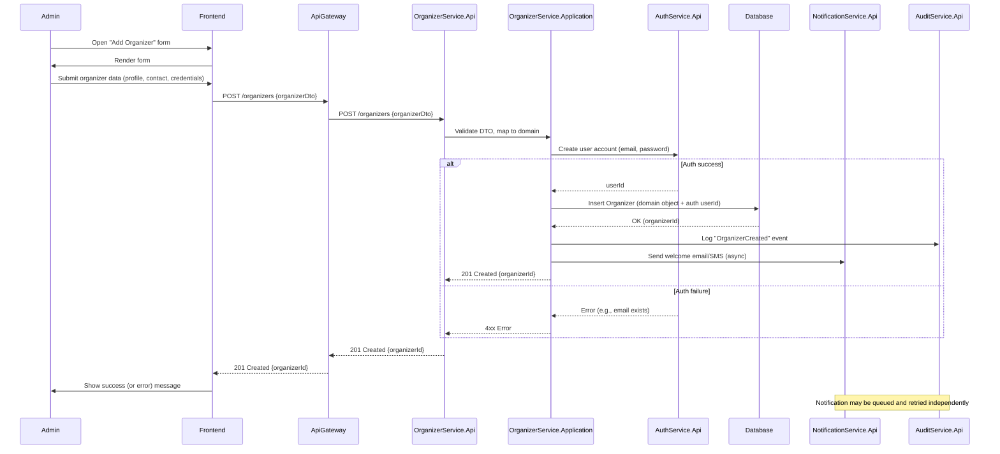

**Add New Organizer — Sequence Diagram**

This document shows a sequence diagram (Mermaid) and brief guidance for implementing the "Add New Organizer" flow.

**Overview**
- **Actor**: `Admin` (or a system user with organizer-creation privileges)
- **Systems**: `Frontend`, `ApiGateway`, `OrganizerService`, `AuthService`, `NotificationService`, `Database`, `AuditService`

**Mermaid Sequence Diagram**

**What each lifeline is responsible for**
- **`Admin`**: Human actor initiating the flow.
- **`Frontend`**: Validates form input client-side, posts DTO to API.
- **`ApiGateway`**: Authentication, request routing, rate-limiting, and API composition.
- **`OrganizerService.Api`**: HTTP adapter; does request/response shaping, simple validation.
- **`OrganizerService.Application`**: Domain logic — verifies business rules, coordinates collaborators.
- **`AuthService.Api`**: Creates authentication credentials and returns a `userId` (or errors).
- **`Database`**: Persists organizer domain records and references to auth `userId`.
- **`NotificationService.Api`**: Sends Welcome messages asynchronously.
- **`AuditService.Api`**: Records an immutable event for observability/compliance.

**Notes & best practices for the diagram and implementation**
- **Synchronous vs asynchronous**: Keep account creation and DB insert synchronous for atomic feedback to the admin; send welcome notifications and audit logging asynchronously (or at least resiliently) so those tasks don't block the user.
- **Transactions & consistency**: If you need strong consistency between `AuthService` and `OrganizerService` consider a saga pattern: if DB insert fails after auth is created, rollback (delete user) or mark the user as pending and schedule compensation.
- **Error handling**: Show alternate flows in the diagram for common failures (email already exists, validation errors, DB constraints). Use `alt` blocks in Mermaid to represent these.
- **Security**: Ensure `ApiGateway` verifies the caller is authorized to create organizers; never return raw credentials in responses.
- **Retries**: For async notifications, use durable queues and idempotency keys to avoid duplicate messages.

**Alternative flows to document**
- Validation fails (client-side and server-side)
- AuthService rejects (duplicate email)
- DB constraint violation (unique keys, FK failures)
- Notification queue failure (retry/backoff)

**How to write this in other formats**
- For UML tools, translate Mermaid lifelines and messages into participants and messages, keeping `alt` for branching.
- Keep message labels concise and include payload hints (e.g., `{organizerDto}`, `userId`, `{organizerId}`).

---
If you want, I can: generate a PNG/SVG of this Mermaid diagram, add a variant for an organizer self-signup flow, or adapt the diagram to a specific service class/method names in the repo.
